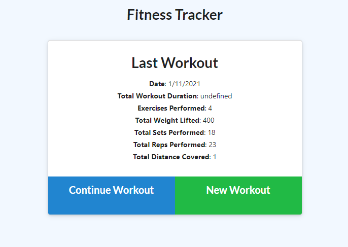
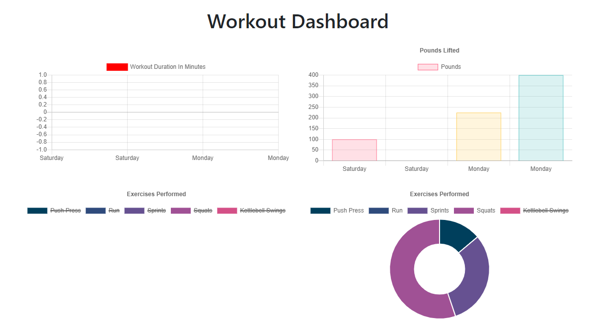
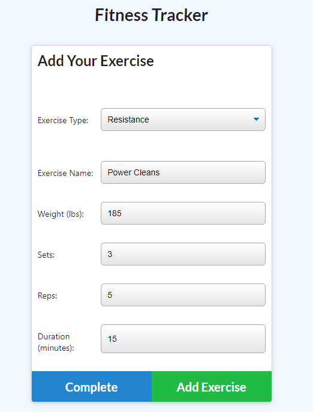

# WorkoutTracker

https://workouttrackeruncral.herokuapp.com/

## Description

- A fitness tracking application to log your workouts. You can add cardio and resistance exercises, sets, reps, distance, and duration. Track your workout and see the totals at the end of each session. The dashboard gives you a visual breakdown and graphs of the exercises and weekly comparisions.

### Technologies Used and Installation

- HTML, CSS, JavaScript, Node, Express, MongoDB
  -- To run locally, download this repository and run this command in your terminal "npm i" to install the following node packages: express, mongoose, morgan. Then enter "node server.js" in the terminal and go to http://localhost:4000 in your browser to use the app.

--- Run on browser via: https://workouttrackeruncral.herokuapp.com/

-------Initial Commit
File organization
Folders Made
Initial info for server html routes and index js files
Initial connection with Mongo Atlas and Heroku
Server code for Mongoose updated

------------Second Commit
Workout JS file written
Heroku link test

------------Third Commit
Working app with routes
Changed CSS on html pages so buttons are easier to read
